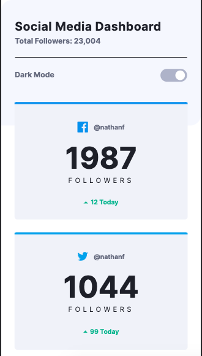

# Frontend Mentor - Social media dashboard with theme switcher solution

This is a solution to the [Social media dashboard with theme switcher challenge on Frontend Mentor](https://www.frontendmentor.io/challenges/social-media-dashboard-with-theme-switcher-6oY8ozp_H). Frontend Mentor challenges help you improve your coding skills by building realistic projects. 

## Table of contents

- [Overview](#overview)
  - [The challenge](#the-challenge)
  - [Screenshot](#screenshot)
  - [Links](#links)
- [My process](#my-process)
  - [Built with](#built-with)
  - [What I learned](#what-i-learned)
  - [Continued development](#continued-development)
  - [Useful resources](#useful-resources)
- [Author](#author)

**Note: Delete this note and update the table of contents based on what sections you keep.**

## Overview

### The challenge

Users should be able to:

- View the optimal layout for the site depending on their device's screen size
- See hover states for all interactive elements on the page
- Toggle color theme to their preference

### Screenshot




### Links

- [Solution URL](https://github.com/kbrandon19/Social-Media-Dashboard)
- [Live Site](https://kbrandon19.github.io/Social-Media-Dashboard/)

## My process

### Built with

- Semantic HTML5 markup
- CSS custom properties
- Javascript
- Flexbox
- Mobile-first workflow


### What I learned

With SCSS I was having a hard time determining how to include :hover since I normal do it with CSS. In SCSS it's all about nesting so it only made sense that it would go within the element you're trying to manipulate. 

I also learned about using labels and buttons for the toggle. This was my first time trying this so I am most certainly pleased.


```scss
.example{

width:100%;
height:auto;
background-color:#d3e3e3;
border-radius:15px;
transition: background-color .4s ease;
  
  &:hover{
    background-color:#a3a3a3;
  }
}
```


### Continued development

I want to focus more on understanding Flexbox better and how it interacts with elements inside it and vice versa. Not only that but I want to incorporate more Javascript within my work. 

### Useful resources

- [SCSS Parent Selector](https://sass-lang.com/documentation/style-rules/parent-selector) - This helped me incorporate the hover feature for the cards.


## Author

- Website - [Website](https://www.mrdebonairfox.com)
- Frontend Mentor - [@kbrandon19](https://www.frontendmentor.io/profile/kbrandon19)
- Twitter - [@mrdebonairfox](https://www.twitter.com/mrdebonairfox)


